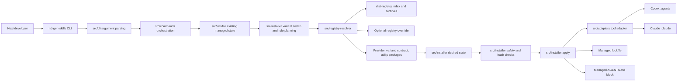
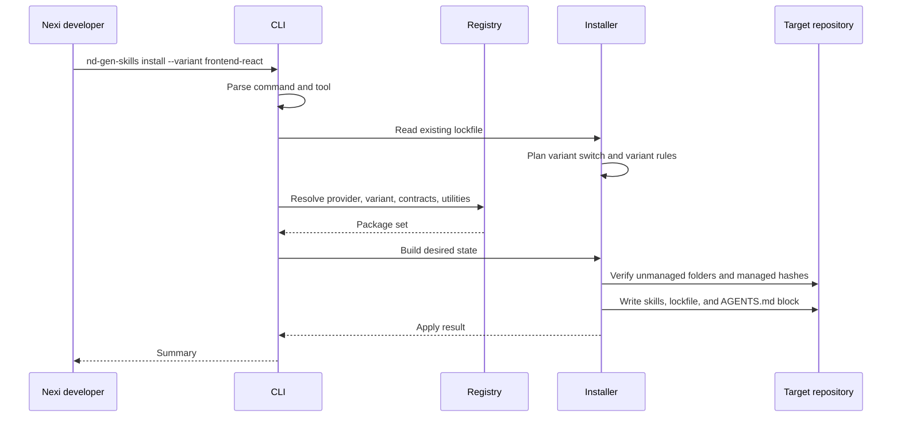

# Architecture

`@nexidigital/nd-gen-skills` is a Node 20+ TypeScript CLI that installs approved Nexi AI skill packages into Codex and Claude repositories.

The CLI does not execute AI workflows. It resolves a packaged skill distribution, computes the desired repository state, applies filesystem changes safely, and records ownership in a tool-specific lockfile.

## System Overview

## Core Modules

| Area | Responsibility |
| --- | --- |
| `src/cli` | Parses command-line arguments and dispatches CLI execution. |
| `src/commands` | Coordinates install, sync, utility, list, and validate commands. |
| `src/registry` | Resolves the registry source, reads the index, and loads package archives. |
| `src/schemas` | Validates package manifests and lockfile shape. |
| `src/installer` | Builds desired state, plans variant changes, applies files, and validates managed state. |
| `src/adapters` | Maps supported tools to repository-local skill and lockfile paths. |
| `src/lockfile` | Reads and writes the tool-specific managed ownership file. |
| `src/agents-md` | Renders and updates the managed Nexi block in root `AGENTS.md`. |
| `packages` | Canonical provider, variant, contract, and utility package sources. |
| `dist-registry` | Generated registry index and package archives included in the npm package. |

## Package Model

The registry contains four package kinds:

| Kind | Purpose |
| --- | --- |
| Provider | Supplies the base workflow skills, such as `superpowers` or `workflow-stack`. |
| Variant | Installs one visible Nexi runtime skill for a repository type, such as `frontend-react` or `backend-java`. |
| Contract | Supplies shared workflow rules, templates, and cross-runtime expectations. |
| Utility | Adds optional or dependency-driven helper skills, such as documentation, Figma, TDD, or backend tooling. |

Provider packages define capabilities such as requirements design, planning, execution, TDD, debugging, verification, and code review. Variant packages declare the provider capabilities, contracts, and utilities they require.

## Install Flow

## Tool Adapters

Codex and Claude use the same installer logic with different filesystem roots:

| Tool | Skill root | Lockfile |
| --- | --- | --- |
| `codex` | `.agents/skills` | `.agents/nd-gen-skills.lock.yaml` |
| `claude` | `.claude/skills` | `.claude/nd-gen-skills.lock.yaml` |

Both tool adapters update the same root `AGENTS.md` managed block. Content outside the managed block is preserved.

## Safety Model

The installer mutates only managed skill folders, the tool lockfile, and the marked `AGENTS.md` block. It refuses to overwrite unmanaged local skills.

Managed file hashes are recorded in the lockfile. For install and sync operations, local changes to managed files fail in CI or non-interactive contexts unless `--force` is supplied to overwrite the managed content. Variant switches require `--replace-variant`.

Utility add and remove commands first reject existing managed-file drift before changing the utility set.

Use `validate --ci` in automation to detect drift without changing files.

## Registry Model

Registry lookup order is:

1. `--registry` command flag.
2. `NEXI_AI_SKILLS_REGISTRY` environment variable.
3. Bundled `dist-registry`.

The bundled registry is generated from `packages/` by `npm run build:registry`. The CLI consumes registry archives rather than raw package source.

## Release Model

Published package releases are automated on pushes to `main` through GitHub Actions and `semantic-release`.

The release workflow installs dependencies, runs the Vitest suite, runs `npm run prepare`, and then runs `npm run release`. `prepare` compiles TypeScript and regenerates the bundled `dist-registry` before the package is published.

Semantic release uses conventional commits to calculate the next version, writes release notes, updates `CHANGELOG.md`, updates `package.json` and `package-lock.json`, creates a `v${version}` tag, publishes to the Nexi Artifactory npm registry, and creates the GitHub release.

The Artifactory registry URL is configured in `.npmrc`. Publishing requires repository secret `ARTIFACTORY_NPM_TOKEN`, which the release workflow exposes to npm as `NPM_TOKEN` and `NODE_AUTH_TOKEN`.

## Extension Points

Add a provider by creating a provider package manifest and declaring its workflow skills and capabilities.

Add a runtime variant by creating a variant package with one runtime skill, required provider capabilities, required contracts, and required utilities.

Add a utility by creating a utility package manifest and skill folder. Mark utilities as internal when they should be dependency-only and hidden from user-facing `add-skill` flows.

Future remote registries can fit behind the existing registry resolution boundary without changing command behavior.

Maintainer checklist:

1. Update the package manifest and package source.
2. Run `npm test`.
3. Run `npm run prepare` to verify TypeScript output and bundled registry generation.
4. Run `npm run release:dry-run` before merging release-impacting changes.

## Testing Strategy

Unit tests cover argument parsing, manifest and lockfile schemas, registry loading, package content, installer planning, file ownership safety, adapter paths, and `AGENTS.md` block rendering.

Integration tests run the built CLI against temporary repositories to verify install, sync, utility installation/removal, validation, and safety behavior.

Documentation-only changes should run `git diff --check` and perform manual link/path review. Source or package changes should also run `npm test`.
