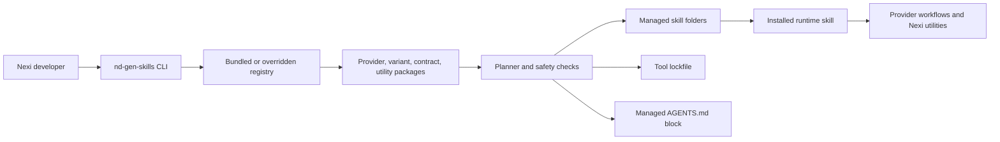

# ND Gen Skills

`@nexidigital/nd-gen-skills` installs approved Nexi AI workflow skills into Codex and Claude repositories.

The package gives Nexi teams one repeatable way to add provider workflows, runtime guidance, workflow contracts, and optional utility skills to a repository without copying skill folders by hand.

## Who This Is For

This repository is for internal Nexi developers and maintainers. It focuses on fast onboarding, transparent architecture, and repeatable install commands across teams and repositories.

## Documentation Map

Use this map to move through the documentation without reading every page in order.

| Need | Start here | Then read |
| --- | --- | --- |
| Understand the installer | [Installer guide](guides/install/README.md) | [Architecture](ARCHITECTURE.md) |
| Login to Artifactory and install | [Artifactory login and install](guides/install/artifactory-login.md) | [Published package install](guides/install/published-package.md) |
| Install skills in a repository | [Published package install](guides/install/published-package.md) | [Runtime variants](guides/variants.md) |
| Install a specific support utility | [Support utility skills](guides/utilities/support-utility-skills.md) | [Published package install](guides/install/published-package.md) |
| Install and use `documentation-kit` | [Documentation Kit](guides/utilities/documentation-kit.md) | [Support utility skills](guides/utilities/support-utility-skills.md) |
| Test unreleased package changes | [Local tarball install](guides/install/local-tarball.md) | [Architecture](ARCHITECTURE.md) |
| Distribute developer install and usage docs | [Developer guide pack](guides/developer-distribution/README.md) | [Local tarball install](guides/developer-distribution/installation/local-tarball.md) |
| Maintain package releases | [Release process](guides/install/release-process.md) | [Architecture](ARCHITECTURE.md) |
| Pick the default lightweight workflow | [Superpowers provider](guides/providers/superpowers.md) | [Runtime variants](guides/variants.md) |
| Run implementation plans with Codex subagents | [Codex subagents with Superpowers](guides/developer-distribution/workflow/codex-subagents-superpowers.md) | [Superpowers provider](guides/providers/superpowers.md) |
| Pick the governed delivery workflow | [Workflow Stack provider](guides/providers/workflow-stack.md) | [Architecture](ARCHITECTURE.md) |
| Understand installer internals | [Architecture](ARCHITECTURE.md) | [Published package install](guides/install/published-package.md) |

### Installation Guides

- [Installer guide](guides/install/README.md): general entry point for what the installer does, how to run it, and how managed files are protected.
- [Artifactory login and install](guides/install/artifactory-login.md): configure npm authentication for the Nexi Artifactory registry and run the first install.
- [Published package install](guides/install/published-package.md): use the released `@nexidigital/nd-gen-skills` package from a target repository.
- [Local tarball install](guides/install/local-tarball.md): install a provided tarball package into a target repository.
- [Developer guide pack](guides/developer-distribution/README.md): Codex-only distributable guides for local tarball install, Artifactory install, Superpowers workflow, documentation-kit, and utility skills.
- [Release process](guides/install/release-process.md): maintain the semantic-release and Artifactory publication flow.


### Install From Registry

For a user-ready authentication walkthrough, see [Artifactory login and install](guides/install/artifactory-login.md).

Configure npm (`.npmrc`):

```bash
@nexidigital:registry=https://artifactory.nexicloud.it/artifactory/api/npm/libs-nexidigital-local
always-auth=true
//artifactory.nexicloud.it/artifactory/api/npm/libs-nexidigital-local/:_authToken=${NPM_TOKEN}
```

Configure Yarn (`.yarnrc.yml`):

```yaml
npmScopes:
  nexidigital:
    npmRegistryServer: "https://artifactory.nexicloud.it/artifactory/api/npm/libs-nexidigital-local"
    npmAlwaysAuth: true
    npmAuthToken: "${NPM_TOKEN}"
```

Install the remote package on a developer machine:

```bash
npm install -g @nexidigital/nd-gen-skills
```

Use the `-g` flag for a machine-wide CLI install. A plain `npm install @nexidigital/nd-gen-skills` installs the package only in the current repository.

### Workflow Guides

- [Superpowers provider](guides/providers/superpowers.md): lightweight design, planning, implementation, review, and verification workflows.
- [Codex subagents with Superpowers](guides/developer-distribution/workflow/codex-subagents-superpowers.md): run and adapt subagent-driven implementation from approved Superpowers plans.
- [Workflow Stack provider](guides/providers/workflow-stack.md): governed delivery workflows with requirements, artifacts, tests, and traceability.

### Utility Guides

- [Support utility skills](guides/utilities/support-utility-skills.md): install focused utilities such as documentation, design documentation, terminology, TDD, Figma, E2E, backend, and mobile helpers.
- [Documentation Kit](guides/utilities/documentation-kit.md): install and use the umbrella documentation utility, including the governance standard it should follow.

### Runtime And Architecture

- [Runtime variants](guides/variants.md): compact guide to `frontend-react`, `backend-java`, `mobile-ios`, and `mobile-android`.
- [Architecture](ARCHITECTURE.md): technical model for the CLI, registry, installer, adapters, lockfiles, and managed skill writes.

## Quick Start

Run the default Codex install from the repository that should receive the managed skills:

```bash
npx -y @nexidigital/nd-gen-skills install --variant frontend-react
```

This installs the default `superpowers` provider, the `frontend-react` runtime, required workflow contracts, and runtime utilities under `.agents/skills`.

If you installed the package globally with `npm install -g @nexidigital/nd-gen-skills`, you can use the global CLI instead:

```bash
nd-gen-skills install --variant frontend-react
```

For Claude repository-local skills, add `--tool claude`:

```bash
npx -y @nexidigital/nd-gen-skills install --tool claude --variant frontend-react
```

## Choose A Provider

| Provider | Use case | Install example |
| --- | --- | --- |
| `superpowers` | Default lightweight design-plan-build workflow for feature work, debugging, TDD, review, and verification. | `npx -y @nexidigital/nd-gen-skills install --variant frontend-react` |
| `workflow-stack` | Governed enterprise workflow for Jira or requirement evidence, workflow artifacts, test design, and traceable delivery. | `npx -y @nexidigital/nd-gen-skills install --provider workflow-stack --variant frontend-react` |

Use `superpowers` when a team needs a fast but disciplined implementation loop. Use `workflow-stack` when the work needs explicit readiness checks, requirements extraction, architecture artifacts, test design, and workflow state.

## Choose A Variant

| Variant | Runtime skill | Best fit |
| --- | --- | --- |
| `frontend-react` | `nexi-frontend-react-runtime` | React frontend repositories, UI implementation, browser verification, and design-to-code work. |
| `backend-java` | `nexi-backend-java-runtime` | Java backend services, controller/service boundaries, deployment guidance, Jenkins, and API test flows. |
| `mobile-ios` | `nexi-mobile-ios-runtime` | iOS repositories, XCTest/UI test guidance, simulator constraints, and Figma-aware mobile work. |
| `mobile-android` | `nexi-mobile-android-runtime` | Android repositories, Gradle test flows, instrumented tests, layout inspection, and Figma-aware mobile work. |

Only one runtime variant is active per tool installation. To switch variants, use `--replace-variant`.

## Common Commands

Install a runtime:

```bash
npx -y @nexidigital/nd-gen-skills install --variant frontend-react
```

Install the governed Workflow Stack provider:

```bash
npx -y @nexidigital/nd-gen-skills install --provider workflow-stack --variant backend-java
```

Replace an installed variant:

```bash
npx -y @nexidigital/nd-gen-skills install --variant mobile-android --replace-variant
```

Refresh managed skills from the bundled registry:

```bash
npx -y @nexidigital/nd-gen-skills sync
```

Install or remove an optional utility skill:

```bash
npx -y @nexidigital/nd-gen-skills add-skill documentation-kit
npx -y @nexidigital/nd-gen-skills remove-skill documentation-kit
```

Inspect and validate an installation:

```bash
npx -y @nexidigital/nd-gen-skills list
npx -y @nexidigital/nd-gen-skills list --available
npx -y @nexidigital/nd-gen-skills validate --ci
```

## What Gets Installed

For Codex, the installer writes managed skills under `.agents/skills`, records ownership in `.agents/nd-gen-skills.lock.yaml`, and maintains a marked Nexi block in `AGENTS.md`.

For Claude, the installer writes managed skills under `.claude/skills`, records ownership in `.claude/nd-gen-skills.lock.yaml`, and uses the same managed `AGENTS.md` block model.

The lockfile records installed provider, variant, contract, utility, and file hash state. Commands refuse to overwrite unmanaged local skills, and changed managed files are protected unless the command explicitly supports `--force`.

## How To Use The Skills

After install, start normal development work from the runtime skill named in `AGENTS.md`. The runtime skill knows the selected provider, variant, contracts, and utilities.

Use direct provider skill calls when intentionally entering a specific workflow phase:

```text
Use $brainstorming to refine this feature idea using the installed runtime variant:
Add a saved beneficiary search filter that remembers the user's last query.
```

For documentation work, install `documentation-kit` and use it to create or reconcile repository documentation from the local source of truth:

```bash
npx -y @nexidigital/nd-gen-skills add-skill documentation-kit
```

For installation details, companion utilities, and the required governance reference, see [Documentation Kit](guides/utilities/documentation-kit.md).

## How It Works



For technical details, see [ARCHITECTURE.md](ARCHITECTURE.md).

## Maintainer Workflow

Install dependencies:

```bash
npm ci
```

Build the CLI and bundled registry:

```bash
npm run prepare
```

Run tests:

```bash
npm test
```

Run a local release dry run:

```bash
npm run release:dry-run
```

Automated release on `main` is handled by GitHub Actions with `semantic-release`.
Set repository secret `ARTIFACTORY_NPM_TOKEN` to enable npm publish on Artifactory.
For release details, see [Release process](guides/install/release-process.md).

Create a local tarball for target-repo testing:

```bash
mkdir -p dist
npm run pack
```
