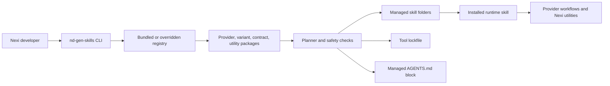
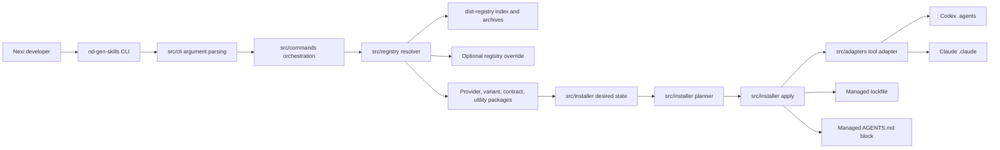
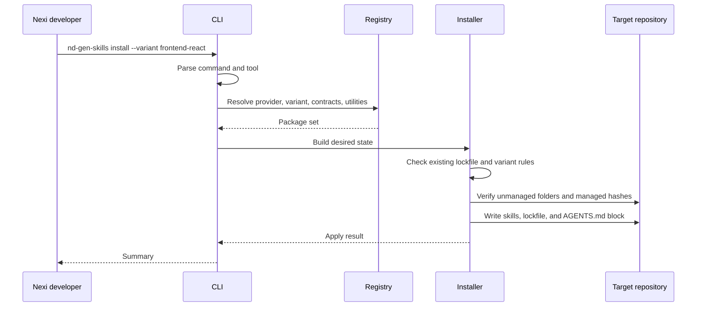

# Repository Documentation Implementation Plan

> **For agentic workers:** REQUIRED SUB-SKILL: Use superpowers:subagent-driven-development (recommended) or superpowers:executing-plans to implement this plan task-by-task. Steps use checkbox (`- [ ]`) syntax for tracking.

**Goal:** Restructure the repository documentation into an internal Nexi README, canonical guide pages, and a technical architecture document.

**Architecture:** Keep the root README as a concise project portal and move operational detail into `guides/`. Add `ARCHITECTURE.md` as the technical reference for maintainers, with Mermaid diagrams in both README and architecture docs. Preserve the four root guide drafts as source material by migrating their content into canonical guide paths and deleting the root copies.

**Tech Stack:** Markdown, Mermaid, existing TypeScript CLI/package structure, Git documentation review commands.

---

## Scope Check

The approved spec is cohesive and documentation-only. It does not require CLI, registry, manifest, test, or package metadata changes.

Do not modify `src/`, `packages/`, `dist-registry/`, `package.json`, or tests unless a documentation link reveals a factual mismatch that cannot be documented accurately without a source change. If that happens, stop and ask for a separate code-change plan.

## File Structure

Create or modify these files:

```text
README.md
ARCHITECTURE.md
guides/install/published-package.md
guides/install/local-tarball.md
guides/providers/superpowers.md
guides/providers/workflow-stack.md
guides/variants.md
```

Remove these root draft files after migrating their content:

```text
how_to.md
how_to_local.md
superpowers_guide.md
workflow_stack_guide.md
```

Responsibilities:

- `README.md`: project landing page, quick start, provider/variant chooser, command summary, diagrams, guide index, maintainer commands.
- `ARCHITECTURE.md`: technical architecture, module responsibilities, package model, install flow, safety model, extension points, verification strategy.
- `guides/install/published-package.md`: published `npx` install flows for Codex and Claude.
- `guides/install/local-tarball.md`: local package build and tarball install flow for maintainers and testers.
- `guides/providers/superpowers.md`: default lightweight provider workflow, direct prompts, artifact locations, codebase documentation use cases.
- `guides/providers/workflow-stack.md`: governed provider workflow, Jira/evidence flow, workflow artifacts, scaffold commands, traceability docs.
- `guides/variants.md`: compact summary of all runtime variants and their installed utilities.

---

### Task 1: Create Canonical Guide Folders And Migrate Draft Files

**Files:**
- Create directory: `guides/install/`
- Create directory: `guides/providers/`
- Move: `how_to.md` to `guides/install/published-package.md`
- Move: `how_to_local.md` to `guides/install/local-tarball.md`
- Move: `superpowers_guide.md` to `guides/providers/superpowers.md`
- Move: `workflow_stack_guide.md` to `guides/providers/workflow-stack.md`

- [ ] **Step 1: Confirm the root draft files exist**

Run:

```bash
git status --short
test -f how_to.md
test -f how_to_local.md
test -f superpowers_guide.md
test -f workflow_stack_guide.md
```

Expected: `git status --short` shows the four root guide drafts as untracked, and each `test -f` exits successfully.

- [ ] **Step 2: Create the guide directories**

Run:

```bash
mkdir -p guides/install guides/providers
```

Expected: command exits successfully.

- [ ] **Step 3: Move the published package guide**

Run:

```bash
mv how_to.md guides/install/published-package.md
```

Expected: `guides/install/published-package.md` exists and `how_to.md` no longer exists.

- [ ] **Step 4: Move the local tarball guide**

Run:

```bash
mv how_to_local.md guides/install/local-tarball.md
```

Expected: `guides/install/local-tarball.md` exists and `how_to_local.md` no longer exists.

- [ ] **Step 5: Move the Superpowers provider guide**

Run:

```bash
mv superpowers_guide.md guides/providers/superpowers.md
```

Expected: `guides/providers/superpowers.md` exists and `superpowers_guide.md` no longer exists.

- [ ] **Step 6: Move the Workflow Stack provider guide**

Run:

```bash
mv workflow_stack_guide.md guides/providers/workflow-stack.md
```

Expected: `guides/providers/workflow-stack.md` exists and `workflow_stack_guide.md` no longer exists.

- [ ] **Step 7: Check migration status**

Run:

```bash
git status --short
```

Expected: the new `guides/` files appear as untracked. The old root draft files no longer appear.

---

### Task 2: Rewrite The README As The Project Landing Page

**Files:**
- Modify: `README.md`

- [ ] **Step 1: Replace `README.md` with the landing page content**

Edit `README.md` to use this structure and content:

~~~markdown
# ND Gen Skills

`@nexidigital/nd-gen-skills` installs approved Nexi AI workflow skills into Codex and Claude repositories.

The package gives Nexi teams one repeatable way to add provider workflows, runtime guidance, workflow contracts, and optional utility skills to a repository without copying skill folders by hand.

## Who This Is For

This repository is for internal Nexi developers and maintainers. It focuses on fast onboarding, transparent architecture, and repeatable install commands across teams and repositories.

## Quick Start

Run the default Codex install from the repository that should receive the managed skills:

```bash
npx -y @nexidigital/nd-gen-skills install --variant frontend-react
```

This installs the default `superpowers` provider, the `frontend-react` runtime, required workflow contracts, and runtime utilities under `.agents/skills`.

For Claude repository-local skills, add `--tool claude`:

```bash
npx -y @nexidigital/nd-gen-skills install --tool claude --variant frontend-react
```

## Choose A Provider

| Provider | Use case | Install example |
| --- | --- | --- |
| `superpowers` | Default lightweight design-plan-build workflow for feature work, debugging, TDD, review, and verification. | `npx -y @nexidigital/nd-gen-skills install --variant frontend-react` |
| `workflow-stack` | Governed enterprise workflow for Jira or requirement evidence, workflow artifacts, test design, and traceable delivery. | `npx -y @nexidigital/nd-gen-skills install --provider workflow-stack --variant frontend-react` |

Use `superpowers` when a team needs a fast but disciplined implementation loop. Use `workflow-stack` when the work needs explicit readiness checks, requirements extraction, architecture artifacts, test design, and workflow state.

## Choose A Variant

| Variant | Runtime skill | Best fit |
| --- | --- | --- |
| `frontend-react` | `nexi-frontend-react-runtime` | React frontend repositories, UI implementation, browser verification, and design-to-code work. |
| `backend-java` | `nexi-backend-java-runtime` | Java backend services, controller/service boundaries, deployment guidance, Jenkins, and API test flows. |
| `mobile-ios` | `nexi-mobile-ios-runtime` | iOS repositories, XCTest/UI test guidance, simulator constraints, and Figma-aware mobile work. |
| `mobile-android` | `nexi-mobile-android-runtime` | Android repositories, Gradle test flows, instrumented tests, layout inspection, and Figma-aware mobile work. |

Only one runtime variant is active per tool installation. To switch variants, use `--replace-variant`.

## Common Commands

Install a runtime:

```bash
npx -y @nexidigital/nd-gen-skills install --variant frontend-react
```

Install the governed Workflow Stack provider:

```bash
npx -y @nexidigital/nd-gen-skills install --provider workflow-stack --variant backend-java
```

Replace an installed variant:

```bash
npx -y @nexidigital/nd-gen-skills install --variant mobile-android --replace-variant
```

Refresh managed skills from the bundled registry:

```bash
npx -y @nexidigital/nd-gen-skills sync
```

Install or remove an optional utility skill:

```bash
npx -y @nexidigital/nd-gen-skills add-skill documentation-kit
npx -y @nexidigital/nd-gen-skills remove-skill documentation-kit
```

Inspect and validate an installation:

```bash
npx -y @nexidigital/nd-gen-skills list
npx -y @nexidigital/nd-gen-skills list --available
npx -y @nexidigital/nd-gen-skills validate --ci
```

## What Gets Installed

For Codex, the installer writes managed skills under `.agents/skills`, records ownership in `.agents/nd-gen-skills.lock.yaml`, and maintains a marked Nexi block in `AGENTS.md`.

For Claude, the installer writes managed skills under `.claude/skills`, records ownership in `.claude/nd-gen-skills.lock.yaml`, and uses the same managed `AGENTS.md` block model.

The lockfile records installed provider, variant, contract, utility, and file hash state. Commands refuse to overwrite unmanaged local skills, and changed managed files are protected unless the command explicitly supports `--force`.

## How To Use The Skills

After install, start normal development work from the runtime skill named in `AGENTS.md`. The runtime skill knows the selected provider, variant, contracts, and utilities.

Use direct provider skill calls when intentionally entering a specific workflow phase:

```text
Use $brainstorming to refine this feature idea using the installed runtime variant:
Add a saved beneficiary search filter that remembers the user's last query.
```

For documentation work, install `documentation-kit` and use it to create or reconcile repository documentation from the local source of truth:

```bash
npx -y @nexidigital/nd-gen-skills add-skill documentation-kit
```

## How It Works



For technical details, see [ARCHITECTURE.md](ARCHITECTURE.md).

## Guides

- [Install from the published package](guides/install/published-package.md)
- [Install from a local tarball](guides/install/local-tarball.md)
- [Superpowers provider guide](guides/providers/superpowers.md)
- [Workflow Stack provider guide](guides/providers/workflow-stack.md)
- [Runtime variants](guides/variants.md)

## Maintainer Workflow

Install dependencies:

```bash
npm ci
```

Build the CLI:

```bash
npm run build
```

Build the bundled registry:

```bash
npm run build:registry
```

Run tests:

```bash
npm test
```

Create a local tarball for target-repo testing:

```bash
mkdir -p dist
npm pack --pack-destination dist --ignore-scripts
```
~~~

- [ ] **Step 2: Review README links**

Run:

```bash
rg -n "\]\(" README.md
```

Expected: links point only to `ARCHITECTURE.md` and files under `guides/`.

---

### Task 3: Add The Technical Architecture Document

**Files:**
- Create: `ARCHITECTURE.md`

- [ ] **Step 1: Create `ARCHITECTURE.md`**

Create `ARCHITECTURE.md` with this content:

~~~markdown
# Architecture

`@nexidigital/nd-gen-skills` is a Node 20+ TypeScript CLI that installs approved Nexi AI skill packages into Codex and Claude repositories.

The CLI does not execute AI workflows. It resolves a packaged skill distribution, computes the desired repository state, applies filesystem changes safely, and records ownership in a tool-specific lockfile.

## System Overview



## Core Modules

| Area | Responsibility |
| --- | --- |
| `src/cli` | Parses command-line arguments and dispatches CLI execution. |
| `src/commands` | Coordinates install, sync, utility, list, and validate commands. |
| `src/registry` | Resolves the registry source, reads the index, and loads package archives. |
| `src/schemas` | Validates package manifests and lockfile shape. |
| `src/installer` | Builds desired state, plans variant changes, applies files, and validates managed state. |
| `src/adapters` | Maps supported tools to repository-local skill and lockfile paths. |
| `src/lockfile` | Reads and writes the tool-specific managed ownership file. |
| `src/agents-md` | Renders and updates the managed Nexi block in root `AGENTS.md`. |
| `packages` | Canonical provider, variant, contract, and utility package sources. |
| `dist-registry` | Generated registry index and package archives included in the npm package. |

## Package Model

The registry contains four package kinds:

| Kind | Purpose |
| --- | --- |
| Provider | Supplies the base workflow skills, such as `superpowers` or `workflow-stack`. |
| Variant | Installs one visible Nexi runtime skill for a repository type, such as `frontend-react` or `backend-java`. |
| Contract | Supplies shared workflow rules, templates, and cross-runtime expectations. |
| Utility | Adds optional or dependency-driven helper skills, such as documentation, Figma, TDD, or backend tooling. |

Provider packages define capabilities such as requirements design, planning, execution, TDD, debugging, verification, and code review. Variant packages declare the provider capabilities, contracts, and utilities they require.

## Install Flow



## Tool Adapters

Codex and Claude use the same installer logic with different filesystem roots:

| Tool | Skill root | Lockfile |
| --- | --- | --- |
| `codex` | `.agents/skills` | `.agents/nd-gen-skills.lock.yaml` |
| `claude` | `.claude/skills` | `.claude/nd-gen-skills.lock.yaml` |

The root `AGENTS.md` managed block is shared across tools. Content outside the managed block is preserved.

## Safety Model

The installer mutates only managed skill folders, the tool lockfile, and the marked `AGENTS.md` block. It refuses to overwrite unmanaged local skills.

Managed file hashes are recorded in the lockfile. If a managed file changed locally, commands fail in CI or non-interactive contexts unless `--force` is supplied. Variant switches require `--replace-variant`.

Use `validate --ci` in automation to detect drift without changing files.

## Registry Model

Registry lookup order is:

1. `--registry` command flag.
2. `NEXI_AI_SKILLS_REGISTRY` environment variable.
3. Bundled `dist-registry`.

The bundled registry is generated from `packages/` by `npm run build:registry`. The CLI consumes registry archives rather than raw package source.

## Extension Points

Add a provider by creating a provider package manifest and declaring its workflow skills and capabilities.

Add a runtime variant by creating a variant package with one runtime skill, required provider capabilities, required contracts, and required utilities.

Add a utility by creating a utility package manifest and skill folder. Mark utilities as internal when they should be dependency-only and hidden from user-facing `add-skill` flows.

Future remote registries can fit behind the existing registry resolution boundary without changing command behavior.

## Testing Strategy

Unit tests cover argument parsing, manifest and lockfile schemas, registry loading, package content, installer planning, file ownership safety, adapter paths, and `AGENTS.md` block rendering.

Integration tests run the built CLI against temporary repositories to verify install, sync, utility installation/removal, validation, and safety behavior.

Documentation-only changes should run `git diff --check` and perform manual link/path review. Source or package changes should also run `npm test`.
~~~

- [ ] **Step 2: Verify Mermaid fences are balanced**

Run:

```bash
rg -n "```" ARCHITECTURE.md
```

Expected: each opening `mermaid`, `bash`, or `markdown` fence has a matching closing fence.

---

### Task 4: Rewrite Published Package Install Guide

**Files:**
- Modify: `guides/install/published-package.md`

- [ ] **Step 1: Replace the guide with the canonical published install page**

Edit `guides/install/published-package.md` so it contains these sections in this order:

~~~markdown
# Install From The Published Package

Use this guide when installing the approved package from npm with `npx`.

## Provider And Variant Names

| Type | Name | Use case |
| --- | --- | --- |
| Provider | `superpowers` | Default lightweight workflow for design, planning, execution, TDD, review, and verification. |
| Provider | `workflow-stack` | Governed workflow for Jira or requirement evidence, workflow artifacts, and traceable delivery. |
| Variant | `frontend-react` | React frontend repositories. |
| Variant | `backend-java` | Java backend repositories. |
| Variant | `mobile-ios` | iOS repositories. |
| Variant | `mobile-android` | Android repositories. |

## Install For Codex

Install the default Superpowers provider:

```bash
npx -y @nexidigital/nd-gen-skills install --variant frontend-react
```

Install Superpowers explicitly:

```bash
npx -y @nexidigital/nd-gen-skills install --provider superpowers --variant frontend-react
```

Install Workflow Stack:

```bash
npx -y @nexidigital/nd-gen-skills install --provider workflow-stack --variant frontend-react
```

Codex installs managed skills under `.agents/skills`, writes `.agents/nd-gen-skills.lock.yaml`, and updates the managed Nexi block in `AGENTS.md`.

## Install For Claude

Install the default Superpowers provider:

```bash
npx -y @nexidigital/nd-gen-skills install --tool claude --variant frontend-react
```

Install Workflow Stack:

```bash
npx -y @nexidigital/nd-gen-skills install --tool claude --provider workflow-stack --variant frontend-react
```

Claude installs managed skills under `.claude/skills` and writes `.claude/nd-gen-skills.lock.yaml`.

## Replace An Existing Variant

Only one runtime variant should be active per tool installation. Use `--replace-variant` when switching variants:

```bash
npx -y @nexidigital/nd-gen-skills install --variant backend-java --replace-variant
```

Use `--force` only when intentionally overwriting locally changed managed files.

## Start After Install

For normal work, start from the runtime skill recorded in `AGENTS.md`.

For direct Superpowers planning:

```text
Use $brainstorming to refine this feature idea using the installed runtime variant:
Add a saved beneficiary search filter that remembers the user's last query.
```

For direct Workflow Stack orchestration:

```text
Use $workflow-orchestration-kit to coordinate a full workflow-stack run for JIRA PROJ-101 using the installed runtime variant.
```

## Refresh And Validate

Refresh installed managed packages:

```bash
npx -y @nexidigital/nd-gen-skills sync
```

Validate managed files in CI:

```bash
npx -y @nexidigital/nd-gen-skills validate --ci
```

List local and available packages:

```bash
npx -y @nexidigital/nd-gen-skills list
npx -y @nexidigital/nd-gen-skills list --available
```

For Claude installs, add `--tool claude` to `sync`, `validate`, and `list`.

## Optional Utility Skills

Install or remove optional utilities without changing the runtime variant:

```bash
npx -y @nexidigital/nd-gen-skills add-skill documentation-kit
npx -y @nexidigital/nd-gen-skills remove-skill documentation-kit
```

## Related Guides

- [Local tarball install](local-tarball.md)
- [Superpowers provider](../providers/superpowers.md)
- [Workflow Stack provider](../providers/workflow-stack.md)
- [Runtime variants](../variants.md)
~~~

- [ ] **Step 2: Confirm the old root draft wording is gone**

Run:

```bash
test ! -f how_to.md
rg -n "How To Install Workflow Skills$" guides/install/published-package.md
```

Expected: `test ! -f how_to.md` succeeds. `rg` exits with no matches because the canonical title is now `Install From The Published Package`.

---

### Task 5: Rewrite Local Tarball Install Guide

**Files:**
- Modify: `guides/install/local-tarball.md`

- [ ] **Step 1: Replace the guide with the canonical local tarball page**

Edit `guides/install/local-tarball.md` so it contains these sections in this order:

~~~markdown
# Install From A Local Tarball

Use this guide when testing local changes from this repository before publishing the package.

## Build The Tarball

From the `GEN-skills` repository:

```bash
npm ci
npm run build
npm run build:registry
mkdir -p dist
npm pack --pack-destination dist --ignore-scripts
```

Set an absolute tarball path:

```bash
TARBALL="$(ls -t "$PWD"/dist/nexidigital-nd-gen-skills-*.tgz | head -n 1)"
printf '%s\n' "$TARBALL"
```

If a tarball was already provided, set the variable directly:

```bash
TARBALL="/absolute/path/to/nexidigital-nd-gen-skills-0.1.0.tgz"
```

Use an absolute path because install commands run from the target repository.

## Install For Codex

From the target repository:

```bash
npm exec --yes --package "$TARBALL" -- nd-gen-skills install --variant frontend-react
```

Install Workflow Stack:

```bash
npm exec --yes --package "$TARBALL" -- nd-gen-skills install --provider workflow-stack --variant frontend-react
```

Codex installs managed skills under `.agents/skills`, writes `.agents/nd-gen-skills.lock.yaml`, and updates the managed Nexi block in `AGENTS.md`.

## Install For Claude

From the target repository:

```bash
npm exec --yes --package "$TARBALL" -- nd-gen-skills install --tool claude --variant frontend-react
```

Install Workflow Stack for Claude:

```bash
npm exec --yes --package "$TARBALL" -- nd-gen-skills install --tool claude --provider workflow-stack --variant frontend-react
```

Claude installs managed skills under `.claude/skills` and writes `.claude/nd-gen-skills.lock.yaml`.

## Replace An Existing Variant

```bash
npm exec --yes --package "$TARBALL" -- nd-gen-skills install --variant backend-java --replace-variant
```

Use `--force` only when intentionally overwriting locally changed managed files.

## Refresh And Validate From The Same Tarball

```bash
npm exec --yes --package "$TARBALL" -- nd-gen-skills sync
npm exec --yes --package "$TARBALL" -- nd-gen-skills validate --ci
npm exec --yes --package "$TARBALL" -- nd-gen-skills list
npm exec --yes --package "$TARBALL" -- nd-gen-skills list --available
```

For Claude installs, add `--tool claude` to `sync`, `validate`, and `list`.

## Start After Install

For normal work, start from the runtime skill recorded in `AGENTS.md`.

For direct Superpowers planning:

```text
Use $brainstorming to refine this feature idea using the installed runtime variant:
Add a saved beneficiary search filter that remembers the user's last query.
```

For a full Workflow Stack run:

```text
Use $workflow-orchestration-kit to coordinate a full workflow-stack run for JIRA PROJ-101 using the installed runtime variant.
```

## Related Guides

- [Published package install](published-package.md)
- [Superpowers provider](../providers/superpowers.md)
- [Workflow Stack provider](../providers/workflow-stack.md)
- [Runtime variants](../variants.md)
~~~

- [ ] **Step 2: Confirm the local guide references tarball execution**

Run:

```bash
rg -n "npm exec --yes --package \"\\$TARBALL\"" guides/install/local-tarball.md
```

Expected: output includes Codex install, Workflow Stack install, Claude install, sync, validate, and list examples.

---

### Task 6: Rewrite Provider Guides

**Files:**
- Modify: `guides/providers/superpowers.md`
- Modify: `guides/providers/workflow-stack.md`

- [ ] **Step 1: Replace the Superpowers guide**

Edit `guides/providers/superpowers.md` so it contains these sections:

~~~markdown
# Superpowers Provider

`superpowers` is the default provider installed by `@nexidigital/nd-gen-skills`.

Use it when a Nexi team needs a lightweight but disciplined loop for feature design, implementation planning, TDD, debugging, review, and completion.

## Install

```bash
npx -y @nexidigital/nd-gen-skills install --variant frontend-react
npx -y @nexidigital/nd-gen-skills install --provider superpowers --variant frontend-react
```

From a local tarball:

```bash
npm exec --yes --package "$TARBALL" -- nd-gen-skills install --provider superpowers --variant frontend-react
```

## Typical Flow

| Phase | Skill | Use when |
| --- | --- | --- |
| Requirements and design | `brainstorming` | Turning an idea into an approved design/spec. |
| Implementation planning | `writing-plans` | Creating a task-by-task implementation plan from an approved spec. |
| Isolated work | `using-git-worktrees` | Starting feature work without disturbing the current workspace. |
| Execution | `executing-plans` or `subagent-driven-development` | Implementing a written plan. |
| Test-first work | `test-driven-development` | Adding behavior with red-green-refactor discipline. |
| Debugging | `systematic-debugging` | Investigating failures before proposing a fix. |
| Review | `requesting-code-review` and `receiving-code-review` | Checking work or handling review feedback. |
| Completion | `verification-before-completion` | Verifying command output before claiming completion. |
| Branch finish | `finishing-a-development-branch` | Deciding how to merge, PR, or clean up completed work. |

## Direct Prompt Examples

Start design:

```text
Use $brainstorming to refine this feature idea using the installed runtime variant:
Add a saved beneficiary search filter that remembers the user's last query.
```

Create an implementation plan after the spec is approved:

```text
Use $writing-plans to create the implementation plan from docs/superpowers/specs/2026-05-18-beneficiary-search-design.md.
```

Debug a failure:

```text
Use $systematic-debugging to investigate this failing command:
npm test -- tests/beneficiary-search.test.ts
```

Verify completed work:

```text
Use $verification-before-completion to verify the completed work before final response.
```

## Documentation Use Cases

Superpowers documents development as it goes:

- design decisions live in `docs/superpowers/specs/`;
- implementation plans live in `docs/superpowers/plans/`;
- debugging notes capture evidence before fixes;
- verification summaries record the commands that prove completion;
- review skills keep findings tied to files, lines, and risks.

Use this provider when the team needs traceable reasoning without the heavier Workflow Stack artifact set.

## Output Locations

| Artifact | Path |
| --- | --- |
| Design/spec documents | `docs/superpowers/specs/` |
| Implementation plans | `docs/superpowers/plans/` |
| Optional brainstorming companion artifacts | `.superpowers/brainstorm/` |

## Related Guides

- [Published package install](../install/published-package.md)
- [Local tarball install](../install/local-tarball.md)
- [Workflow Stack provider](workflow-stack.md)
- [Runtime variants](../variants.md)
~~~

- [ ] **Step 2: Replace the Workflow Stack guide**

Edit `guides/providers/workflow-stack.md` so it contains these sections:

~~~markdown
# Workflow Stack Provider

`workflow-stack` is the governed enterprise provider installed by `@nexidigital/nd-gen-skills`.

Use it when a Nexi team needs Jira or requirement evidence, explicit workflow gates, structured architecture and test artifacts, and traceable delivery records.

## Install

```bash
npx -y @nexidigital/nd-gen-skills install --provider workflow-stack --variant frontend-react
```

From a local tarball:

```bash
npm exec --yes --package "$TARBALL" -- nd-gen-skills install --provider workflow-stack --variant frontend-react
```

## Typical Flow

| Phase | Skill | Output |
| --- | --- | --- |
| Readiness check | `workflow-us-quality-assessment-kit` | Quality assessment and missing-evidence notes. |
| Orchestration | `workflow-orchestration-kit` | Coordinated run state and phase gates. |
| Requirements | `workflow-planning-kit` | `requirements.md`. |
| Architecture | `workflow-architecture-kit` | `implementation-plan.md` and optional `api-contract.md`. |
| Test design | `workflow-test-design-kit` | `test-cases.md`. |
| Development | `workflow-development-kit` | Code, tests, fixes, and verification notes. |
| Shared support | `workflow-core-kit` | Templates, schemas, references, and role contracts. |

Workflow Stack also installs `grill-me` and `tdd` as required utilities.

## Direct Prompt Examples

Check readiness:

```text
Use $workflow-us-quality-assessment-kit to evaluate whether JIRA PROJ-101 is ready for planning.
```

Start a full run:

```text
Use $workflow-orchestration-kit to coordinate a full workflow-stack run for JIRA PROJ-101 using the installed runtime variant.
```

Extract requirements:

```text
Use $workflow-planning-kit to extract requirements for JIRA PROJ-101 using the installed runtime variant.
Write the output in a new workflow run directory under .workflows/PROJ-101_beneficiary-search.
```

Create architecture:

```text
Use $workflow-architecture-kit to create the implementation plan from .workflows/PROJ-101_beneficiary-search/requirements.md.
```

Create test design:

```text
Use $workflow-test-design-kit to create test-cases.md from .workflows/PROJ-101_beneficiary-search/requirements.md.
```

Develop from approved artifacts:

```text
Use $workflow-development-kit to implement .workflows/PROJ-101_beneficiary-search/implementation-plan.md with the approved test cases.
```

## Scaffold Commands

For Codex installs, scripts live under `.agents/skills`. For Claude installs, replace `.agents/skills` with `.claude/skills`.

Initialize a full workflow run:

```bash
python .agents/skills/workflow-orchestration-kit/scripts/init_orchestration.py \
  --issues PROJ-101 \
  --branch feature/proj-101 \
  --run PROJ-101_beneficiary-search
```

Scaffold requirements:

```bash
python .agents/skills/workflow-planning-kit/scripts/init_planning.py \
  --workflow-dir .workflows/PROJ-101_beneficiary-search \
  --issues PROJ-101
```

Scaffold architecture:

```bash
python .agents/skills/workflow-architecture-kit/scripts/init_architecture.py \
  --workflow-dir .workflows/PROJ-101_beneficiary-search
```

Scaffold architecture with an API contract:

```bash
python .agents/skills/workflow-architecture-kit/scripts/init_architecture.py \
  --workflow-dir .workflows/PROJ-101_beneficiary-search \
  --include-api-contract
```

Scaffold test design:

```bash
python .agents/skills/workflow-test-design-kit/scripts/init_test_design.py \
  --workflow-dir .workflows/PROJ-101_beneficiary-search \
  --variant frontend-react
```

## Documentation Use Cases

Workflow Stack creates a governed evidence trail:

- `workflow-state.yml` records run state and canonical artifact paths;
- `requirements.md` captures Jira or requirement evidence;
- `implementation-plan.md` records architecture and file-level execution decisions;
- `api-contract.md` records producer or consumer API handoff details when relevant;
- `test-cases.md` records unit, integration, E2E, and manual validation coverage;
- automation reports record execution evidence.

Use this provider when delivery must be auditable across requirements, implementation, test design, and verification.

## Output Locations

Workflow Stack writes run artifacts under `.workflows/RUN_ID/`, including:

- `workflow-state.yml`
- `requirements.md`
- `implementation-plan.md`
- `api-contract.md`
- `test-cases.md`
- `automation-test-data.md`
- `automation-test-report.md`

Agents should read canonical artifact paths from `workflow-state.yml` instead of assuming root-level files.

## Related Guides

- [Published package install](../install/published-package.md)
- [Local tarball install](../install/local-tarball.md)
- [Superpowers provider](superpowers.md)
- [Runtime variants](../variants.md)
~~~

- [ ] **Step 3: Verify provider positioning**

Run:

```bash
rg -n "default|lightweight|governed|enterprise|Jira|traceable" guides/providers README.md
```

Expected: output shows Superpowers described as default/lightweight and Workflow Stack as governed/enterprise/traceable.

---

### Task 7: Add The Runtime Variants Summary

**Files:**
- Create: `guides/variants.md`

- [ ] **Step 1: Create `guides/variants.md`**

Create `guides/variants.md` with this content:

~~~markdown
# Runtime Variants

A runtime variant installs one visible Nexi runtime skill that adapts the selected provider to a repository type.

Only one runtime variant is active per tool installation. Use `--replace-variant` when switching variants.

## Summary

| Variant | Runtime skill | Use case | Key installed utilities |
| --- | --- | --- | --- |
| `frontend-react` | `nexi-frontend-react-runtime` | React frontend repositories, route/page work, UI behavior, browser verification, and design-to-code tasks. | `grill-me`, `read-jira-issue`, `figma-use`, `frontend-react-e2e-test-implementation` |
| `backend-java` | `nexi-backend-java-runtime` | Java backend repositories with service/controller boundaries, deployment flows, Jenkins, and API test needs. | `grill-me`, `read-jira-issue`, backend service/controller/deployment/Jenkins/Postman utilities |
| `mobile-ios` | `nexi-mobile-ios-runtime` | iOS repositories with XCTest, UI test, simulator, and design-aware mobile implementation needs. | `grill-me`, `read-jira-issue`, `figma-use` |
| `mobile-android` | `nexi-mobile-android-runtime` | Android repositories with Gradle, instrumented tests, layout inspection, and design-aware mobile implementation needs. | `grill-me`, `read-jira-issue`, `figma-use`, `mobile-android-layout-inspector` |

## How Variants Work

Each variant declares:

- required provider capabilities;
- required workflow contracts;
- required utility skills;
- one runtime skill that agents should use as the normal entry point.

The runtime skill reads repository documentation, applies the selected provider workflow, and brings in variant-specific guidance for development, tests, verification, and documentation.

## Documentation And Verification Expectations

| Variant | Documentation focus | Verification focus |
| --- | --- | --- |
| `frontend-react` | UI behavior, routes/pages, design-system mappings, Figma references, visible copy, and E2E scenarios. | Package scripts, component tests, browser checks, Playwright or equivalent E2E tests when available. |
| `backend-java` | API behavior, service/controller boundaries, deployment notes, Jenkins build steps, Postman collection flows, and API contracts. | Maven or Gradle tests, integration tests, API contract tests, Postman flows, Jenkins build verification when available. |
| `mobile-ios` | Screen behavior, navigation, simulator/device constraints, Figma mappings, and manual tester notes. | Xcode schemes, XCTest, UI tests, simulator validation, device fallback notes. |
| `mobile-android` | Screen behavior, navigation, layout inspection evidence, Figma mappings, and manual tester notes. | Gradle tests, instrumented tests, emulator validation, layout inspector or ADB evidence when relevant. |

## Install Examples

```bash
npx -y @nexidigital/nd-gen-skills install --variant frontend-react
npx -y @nexidigital/nd-gen-skills install --variant backend-java
npx -y @nexidigital/nd-gen-skills install --variant mobile-ios
npx -y @nexidigital/nd-gen-skills install --variant mobile-android
```

Switch variants intentionally:

```bash
npx -y @nexidigital/nd-gen-skills install --variant backend-java --replace-variant
```

## Related Guides

- [Published package install](install/published-package.md)
- [Local tarball install](install/local-tarball.md)
- [Superpowers provider](providers/superpowers.md)
- [Workflow Stack provider](providers/workflow-stack.md)
~~~

- [ ] **Step 2: Check that there is one variants page**

Run:

```bash
find guides -maxdepth 2 -type f -name '*variant*' -print
```

Expected: output includes `guides/variants.md` and no per-variant pages.

---

### Task 8: Documentation Verification And Commit

**Files:**
- Verify: `README.md`
- Verify: `ARCHITECTURE.md`
- Verify: `guides/install/published-package.md`
- Verify: `guides/install/local-tarball.md`
- Verify: `guides/providers/superpowers.md`
- Verify: `guides/providers/workflow-stack.md`
- Verify: `guides/variants.md`

- [ ] **Step 1: Check all documentation paths referenced by README**

Run:

```bash
test -f ARCHITECTURE.md
test -f guides/install/published-package.md
test -f guides/install/local-tarball.md
test -f guides/providers/superpowers.md
test -f guides/providers/workflow-stack.md
test -f guides/variants.md
```

Expected: all commands exit successfully.

- [ ] **Step 2: Check guide cross-links**

Run:

```bash
rg -n "\]\(" README.md ARCHITECTURE.md guides
```

Expected: every relative link points to an existing file in the repository.

- [ ] **Step 3: Check root guide drafts were removed**

Run:

```bash
test ! -e how_to.md
test ! -e how_to_local.md
test ! -e superpowers_guide.md
test ! -e workflow_stack_guide.md
```

Expected: all commands exit successfully.

- [ ] **Step 4: Check whitespace**

Run:

```bash
git diff --check
```

Expected: no output and exit code 0.

- [ ] **Step 5: Review changed files**

Run:

```bash
git status --short
git diff --stat
git diff -- README.md ARCHITECTURE.md guides/install/published-package.md guides/install/local-tarball.md guides/providers/superpowers.md guides/providers/workflow-stack.md guides/variants.md
```

Expected: only the documentation files from this plan are changed. No source, package metadata, generated registry, or test files are changed.

- [ ] **Step 6: Skip package tests unless source changed**

Run this check:

```bash
git diff --name-only | rg '^(src/|packages/|scripts/|tests/|package.json|package-lock.json|tsconfig|vitest.config)'
```

Expected: no output. If there is no output, do not run `npm test` because this is documentation-only. If output appears, stop and create a source-change plan before continuing.

- [ ] **Step 7: Commit the documentation implementation**

Run:

```bash
git add README.md ARCHITECTURE.md guides/install/published-package.md guides/install/local-tarball.md guides/providers/superpowers.md guides/providers/workflow-stack.md guides/variants.md
git status --short
git diff --cached --stat
git commit -m "docs: restructure repository guides"
```

Expected: the commit succeeds and includes only the README, architecture document, and canonical guide files.

---

## Plan Self-Review

Spec coverage:

- README landing page: Task 2.
- Canonical `guides/` folder and root draft migration: Task 1, Tasks 4 through 7, Task 8.
- Provider use cases for `superpowers` and `workflow-stack`: Task 2 and Task 6.
- Codex and Claude installation: Task 2, Task 4, Task 5.
- Published package and local tarball installation: Task 4 and Task 5.
- Skills for development and codebase documentation: Task 2, Task 6, Task 7.
- Compact runtime variants summary: Task 7.
- Root `ARCHITECTURE.md` with diagrams and technical detail: Task 3.
- README architecture overview diagram: Task 2.
- Documentation-only verification: Task 8.

Placeholder scan:

- The plan contains concrete file paths, commands, expected outcomes, and full target Markdown content for created or rewritten documentation files.
- The plan intentionally uses sample issue key `PROJ-101`, sample run name `PROJ-101_beneficiary-search`, and sample variant `frontend-react` for executable documentation examples.

Scope check:

- The plan is limited to documentation files and moved guide drafts.
- Source, package metadata, generated registry, and tests remain out of scope unless a factual documentation mismatch exposes a separate source-change need.
