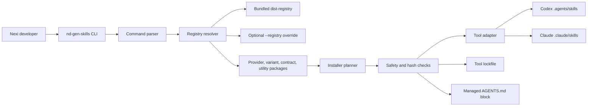

# Repository Documentation Design

Date: 2026-05-18

## Context

`GEN-skills` distributes Nexi AI workflow skills through the `@nexidigital/nd-gen-skills` TypeScript CLI. The current
root `README.md` explains basic installation and command usage, but it does not yet present the repository as a
complete internal developer project.

Four untracked source documents already exist at the repository root and should be treated as source material:

- `how_to.md`
- `how_to_local.md`
- `superpowers_guide.md`
- `workflow_stack_guide.md`

The documentation target audience is internal Nexi developers. The writing and structure should provide a
polished repository experience: clear landing page, task-oriented guides, explicit architecture, and links that make
the package usable without reading implementation code first.

## Goals

- Turn the root `README.md` into a high-quality project landing page for internal Nexi developers.
- Create a canonical `guides/` folder that replaces the four root source guide files.
- Explain each provider use case:
  - `superpowers` as the default lightweight design-plan-build workflow.
  - `workflow-stack` as the governed enterprise workflow for Jira, evidence, workflow artifacts, and traceable delivery.
- Explain installation for both Codex and Claude.
- Explain published npm package installation and local tarball installation.
- Explain how installed skills help developers develop, verify, and document their codebases.
- Add a compact variants summary for `frontend-react`, `backend-java`, `mobile-ios`, and `mobile-android`.
- Add a root `ARCHITECTURE.md` with technical details and a Mermaid architecture diagram.
- Include a smaller architecture overview diagram in the README and link to `ARCHITECTURE.md`.

## Non-Goals

- Change CLI behavior, package manifests, registry contents, or installer safety rules.
- Add a documentation site generator.
- Create one guide page per runtime variant in this pass.
- Rewrite provider or runtime skill contents.
- Add generated assets or screenshots.
- Modify files outside the documentation scope unless a link or path must be corrected.

## Documentation Structure

The repository documentation will use this structure:

```text
README.md
ARCHITECTURE.md
guides/
  install/
    published-package.md
    local-tarball.md
  providers/
    superpowers.md
    workflow-stack.md
  variants.md
```

The four existing root source guide files will be migrated into the new `guides/` structure and removed from the root:

| Source file | Canonical destination |
| --- | --- |
| `how_to.md` | `guides/install/published-package.md` |
| `how_to_local.md` | `guides/install/local-tarball.md` |
| `superpowers_guide.md` | `guides/providers/superpowers.md` |
| `workflow_stack_guide.md` | `guides/providers/workflow-stack.md` |

`guides/variants.md` will be new and compact. It will summarize all supported runtime variants in one page instead of
creating separate variant guides.

## README Design

The README will be the main entry point. It will keep detailed reference material out of the root page and link readers
to the relevant guide pages.

Planned README sections:

1. Project identity and purpose.
2. Internal Nexi audience note focused on fast onboarding and repeatable internal usage.
3. Quick start for the default Codex + `superpowers` installation.
4. Provider decision table:
   - use `superpowers` for lightweight feature design, implementation planning, TDD, review, and verification loops;
   - use `workflow-stack` for governed delivery from Jira or requirements evidence through workflow artifacts.
5. Variant decision table for React frontend, Java backend, iOS, and Android repositories.
6. Common commands: `install`, `sync`, `add-skill`, `remove-skill`, `list`, and `validate`.
7. What gets installed for Codex and Claude: managed skills, lockfile, and `AGENTS.md` block.
8. How to use skills after installation: start from the installed runtime skill for normal work, call provider skills
   directly only when intentionally entering a provider phase, and use documentation utilities when maintaining repo docs.
9. Small Mermaid "How it works" diagram.
10. Guide index.
11. Maintainer development commands: install dependencies, build, build registry, test, and pack.

The README should not duplicate every command variant from the guides. It should give enough detail for a first
successful install and route deeper cases to `guides/`.

## Guide Designs

### `guides/install/published-package.md`

This guide will cover installation from the published package:

- provider and variant names;
- Codex install commands;
- Claude install commands;
- replacing an existing variant with `--replace-variant`;
- use of `--force` only for intentionally overwriting changed managed files;
- first provider-specific prompts after installation;
- `sync`, `validate`, `list`, `add-skill`, and `remove-skill`;
- link back to provider and variant guides.

### `guides/install/local-tarball.md`

This guide will cover maintainer and tester installation from a local tarball:

- building from the `GEN-skills` repo with `npm ci`, `npm run build`, and `npm run build:registry`;
- creating a tarball with `npm pack`;
- using an absolute `TARBALL` path from a target repo;
- Codex and Claude installs from the tarball;
- replacing variants, syncing, validating, and listing from the same tarball.

### `guides/providers/superpowers.md`

This guide will explain when Nexi developers should use the default lightweight provider:

- design/spec work with `brainstorming`;
- implementation planning with `writing-plans`;
- isolated work with `using-git-worktrees`;
- execution through `executing-plans` or `subagent-driven-development` when available;
- TDD, debugging, verification, code review, and branch finishing;
- artifact locations such as `docs/superpowers/specs/` and `docs/superpowers/plans/`;
- how this provider helps document a codebase through specs, plans, verification notes, and final delivery summaries.

### `guides/providers/workflow-stack.md`

This guide will explain when Nexi developers should use the governed enterprise provider:

- readiness and quality assessment;
- full orchestration;
- requirements extraction;
- architecture and implementation planning;
- test design;
- development and verification;
- workflow run artifacts under `.workflows/<run>/`;
- scaffold commands for Codex and Claude skill paths;
- how this provider helps document a codebase through `requirements.md`, `implementation-plan.md`, `api-contract.md`,
  `test-cases.md`, automation reports, and `workflow-state.yml`.

### `guides/variants.md`

This compact guide will summarize all supported runtime variants:

| Variant | Runtime skill | Primary use case | Key utilities |
| --- | --- | --- | --- |
| `frontend-react` | `nexi-frontend-react-runtime` | React frontend repositories | `figma-use`, `frontend-react-e2e-test-implementation` |
| `backend-java` | `nexi-backend-java-runtime` | Java backend repositories | backend service, controller, deployment, Jenkins, Postman utilities |
| `mobile-ios` | `nexi-mobile-ios-runtime` | iOS repositories | `figma-use` |
| `mobile-android` | `nexi-mobile-android-runtime` | Android repositories | `figma-use`, `mobile-android-layout-inspector` |

The page will also explain that each variant installs one visible runtime skill and uses provider, contract, and utility
skills to adapt the workflow to the repository type.

## Architecture Documentation

`ARCHITECTURE.md` will provide technical documentation for maintainers and advanced users.

Planned sections:

- system overview;
- architecture diagram using Mermaid;
- command flow from CLI args to filesystem writes;
- core modules:
  - `src/cli`;
  - `src/registry`;
  - `src/installer`;
  - `src/adapters`;
  - `src/lockfile`;
  - `src/agents-md`;
  - `packages/`;
  - `dist-registry/`;
- package model: providers, variants, contracts, utilities;
- install and sync flow;
- lockfile and managed-file safety model;
- tool adapters for Codex and Claude;
- extensibility points for future providers, variants, utilities, and registry backends;
- testing strategy.

The architecture diagram will show these relationships:



## Error Handling And Safety Documentation

The documentation will make these safety rules explicit:

- the installer manages only its skill folders, lockfile, and marked `AGENTS.md` block;
- unmanaged local skills are not overwritten;
- changed managed files are protected by lockfile hashes;
- `--force` is an intentional overwrite escape hatch;
- `--replace-variant` is required when switching runtime variants;
- `validate --ci` is the recommended CI drift check.

## Verification Plan

Documentation verification will include:

- manually checking all relative links and command paths added to `README.md`, `ARCHITECTURE.md`, and `guides/`;
- running `git diff --check`;
- reviewing `git status --short` to confirm only intended documentation files changed;
- running `npm test` only if package metadata, source code, registry generation, or command behavior changes during
  implementation.

Because the planned implementation is documentation-only, `git diff --check` plus manual link/path review is the
minimum required verification.

## Implementation Notes

- Preserve accurate command syntax from the existing source guide files.
- Keep the README concise enough to scan.
- Keep guide pages task-oriented and avoid duplicating long sections across README and guides.
- Use ASCII punctuation and plain Markdown.
- Use Mermaid for diagrams; do not add image assets.
- Link documentation pages with relative links.
- Do not stage or commit unrelated untracked files except the migrated guide files once implementation starts.
