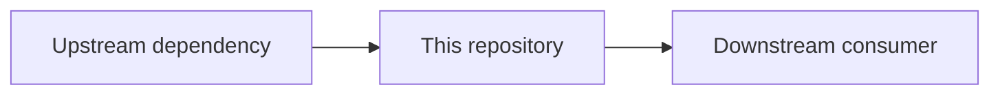

<!-- template-id: architecture-repository -->

# [Repository Name]

> Canonical repository-level architecture document.
> Describe current boundaries, responsibilities, interfaces, and major flows.

## Scope of This File

- **Scope type:** `repository-architecture`
- **This file exists to:** describe the current expected repository architecture, boundaries, interfaces, major flows, and structural constraints.
- **This file must not:** become a backlog, execution plan, release note, or decision log replacement.
- **Use ADRs when:** a change introduces or records a significant architectural decision that needs explicit history and rationale.

## Purpose

- **What this repository is:** [one-sentence system description]
- **Business or domain capability:** [what capability this repository delivers]
- **Execution or distribution form:** [how this repository is built, run, packaged, or consumed]
- **Primary consumers:** [teams, systems, services, users]
- **Out of scope:** [explicit exclusions]

## Scope and Boundary

| Boundary | Owns | Does Not Own | Notes |
|---|---|---|---|
| [runtime, service, app, package, or module] | [owned responsibility] | [adjacent responsibility] | [notes] |

## Architecture Overview

## Major Components

| Component | Responsibility | Key Paths | Interfaces |
|---|---|---|---|
| [component] | [responsibility] | [paths] | [APIs, events, files, or contracts] |

## Data and State

| State | Owner | Storage or Transport | Lifecycle |
|---|---|---|---|
| [state] | [owner] | [store, queue, file, cache] | [creation, update, deletion] |

## Integration Points

| Integration | Direction | Contract | Failure Considerations |
|---|---|---|---|
| [system] | [inbound or outbound] | [API, event, file, schema] | [timeouts, retries, fallback] |

## Constraints

- [runtime, security, compliance, platform, compatibility, or operational constraint]

## Validation

- **Architecture-sensitive checks:** [tests, contract checks, build checks, reviews]
- **Drift indicators:** [signals that this document may need updating]

## Maintenance Rule

Update this file when ownership, boundaries, major components, integrations, state, or architectural constraints materially change.
